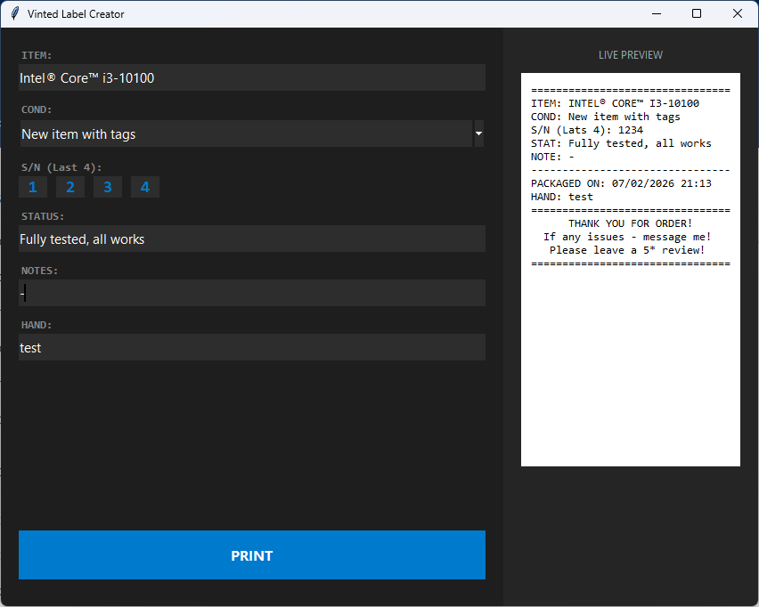

# 🏷️ Vinted Label Creator

A streamlined desktop utility designed for Vinted sellers to generate professional packaging slips instantly. Improve your customer experience and keep your records organized with one click.

---

## ✨ Key Features

* **👁️ Live Preview:** Real-time WYSIWYG display of your label as you type.
* **📝 Detail Tracking:** Fields for Item Name, Condition, S/N, and internal Notes.
* **🕒 Auto-Timestamp:** Automatically generates "Packaged On" data for logistics tracking.
* **⭐ Feedback Oriented:** Includes a pre-built "Thank You" note and a 5-star review reminder to boost your rating.
* **⚡ Quick Print:** Optimized for rapid, high-volume order processing.

---

## 🖨️ Recommended Hardware

For the optimal experience, this software is specifically calibrated for:

### **Goojprt PT-210 Thermal Printer**

* **Optimized Layout:** The label width is perfectly scaled for **58mm** thermal paper.
* **Portability:** Works seamlessly with the PT-210's compact form factor.
* **Cost-Effective:** Zero ink costs—just load the thermal rolls and print.

> [!TIP]
> Make sure the **Goojprt PT-210** is set as your **Default Printer** in Windows for the fastest "One-Click" printing experience.

---

## 🛠️ How It Works

| Field | Description |
| --- | --- |
| **ITEM** | The name of the sold product. |
| **COND** | Select item condition from the dropdown. |
| **S/N** | Record the last 4 digits of the serial number (for fraud protection). |
| **STATUS** | Current order processing state. |
| **HAND** | Initials of the person who packed the order. |

---

## 🚀 Getting Started

1. **Connect:** Plug in your Goojprt PT-210 via USB or pair via Bluetooth.
2. **Input:** Fill in the order details in the left panel.
3. **Verify:** Check the **Live Preview** to ensure all text fits.
4. **Print:** Hit the large blue `PRINT` button.

---

## 📸 Preview

